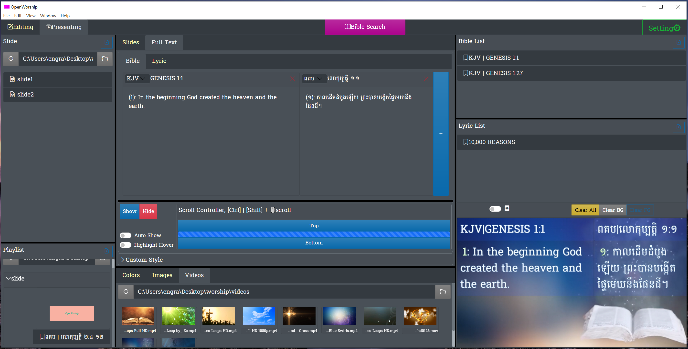

# OpenWorship app (PSA.150.6, Praise the Lord)



Open source and always free for worship presenter.

## Tech Stack
* [Typescript](https://www.typescriptlang.org/)
* [React](https://reactjs.org/)
* [Electron](https://www.electronjs.org/)
* [Bootstrap](https://getbootstrap.com/)
* [SASS](https://sass-lang.com/)

Special Thanks
* [Bootstrap Icons](https://icons.getbootstrap.com/)
* [Sqlite3](https://www.sqlite.org/index.html)
* [React I18Next](https://react.i18next.com/)
* and other frameworks

And Thanks others framework and tool
* sqlite3
* @testing-library/jest-dom
* @testing-library/react
* @testing-library/user-event
* @types/jest
* @types/react
* @types/react-color
* @types/react-dom
* bootstrap
* bootstrap-icons
* concurrently
* electron
* electron-builder
* env-cmd
* i18next
* react
* react-colorful
* react-dom
* react-i18next
* react-scripts
* sass
* typescript
* wait-on
* @typescript-eslint/eslint-plugin": "^4.15.1
* @typescript-eslint/parser": "^4.15.1
* eslint": "^7.20.0

## Install

* copy .env.example to .env

```bash
$ npm i
```

## Run

```bash
$ npm run dev
```
## Package

```bash
# for Windows x86_64
> npm run pack:win

# for Apple Mac
$ npm run pack:mac
```
## Tips

### Present Screen

* Key: Esc
* Bible: Ctrl + Wheel => zoom
* Bible:Bible Presenting: Ctrl + ArrowRight => move to next bible
* Bible:Bible Presenting: Ctrl + ArrowLeft => move to previous bible

### Main Screen

* Ctrl + B => open bible search
* F5 => toggle showing
* F6 => clear background
* F7 => clear foreground
* Bible Search: ArrowUp, ArrowRight, ArrowDown, ArrowLeft => control moving selecting
* Bible Search: Esc => clear input box
* Bible Search:Empty Input Box: Esc => close
* Bible Search: Ctrl + q => close
* Bible Search: Tab => next target
* Bible Search:Found Verses: Ctrl + Enter => add to bible list
* Bible Search:Found Verses: Ctrl + Shift + Enter => add to bible list and present
* Bible Search:Found Verses: Shift + mouse-click => extend verses

## Info

### Bibles and Languages

* There are 2 languages under development English and Khmer.
* There are 4 bibles under development, only Genesis verses is visible, English: KJV, NIV, AMP. Khmer: ពគប

### FYI

* KJV: Psalm 150:6
 => Let every thing that hath breath Praise the LORD. Praise ye the LORD.
* I want to see an application very powerful, easy to use and free for everyone to do presentation during worship service.
* Thanks God for everything. I'm Raksa, the first creator and working alone on this project. But I'm alone cannot make this app possible for using for worship. May God bless this project through you.
* This app will be free forever and absolutely open-source.
* This is not ready to use yet, but I need many help.
* If you have any question or idea please share in [Issues](https://github.com/OpenWorshipApp/open-worship-app-dt/issues), or contact me if you need more information, Raksa Eng <eng.raksa@gmail.com>
* 🙏🏻May God bless you🙏🏻

## Licence

GNU GENERAL PUBLIC LICENSE Version 2